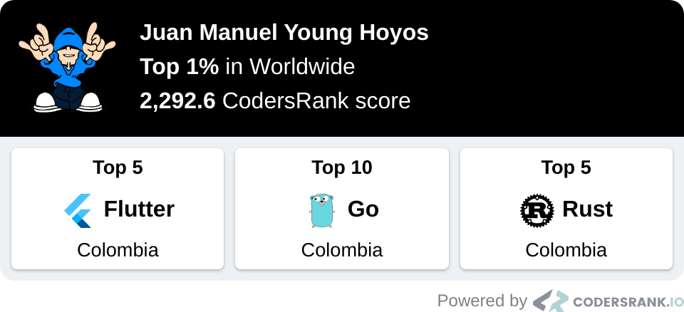
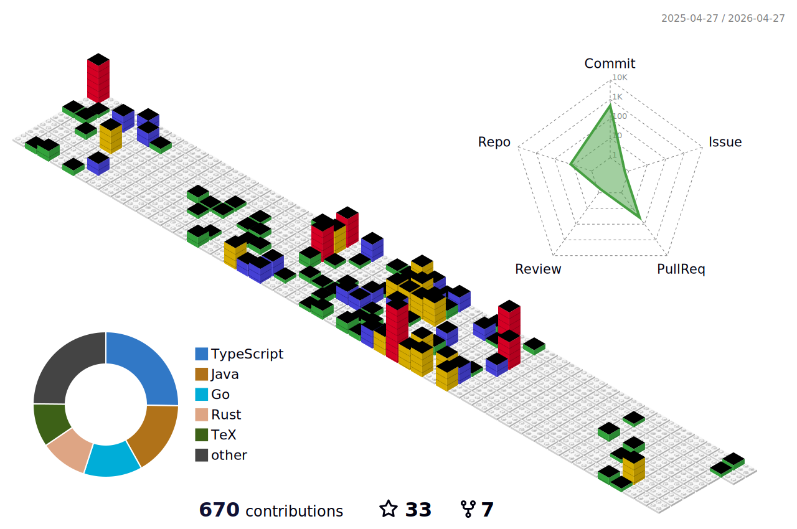
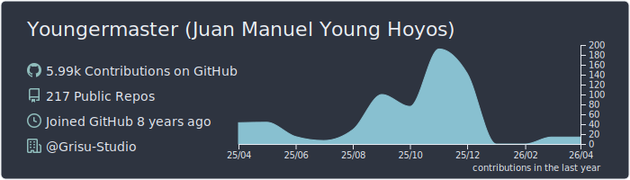
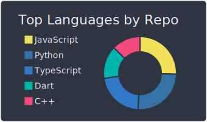
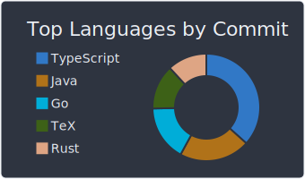
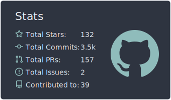
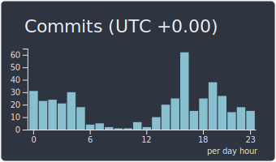
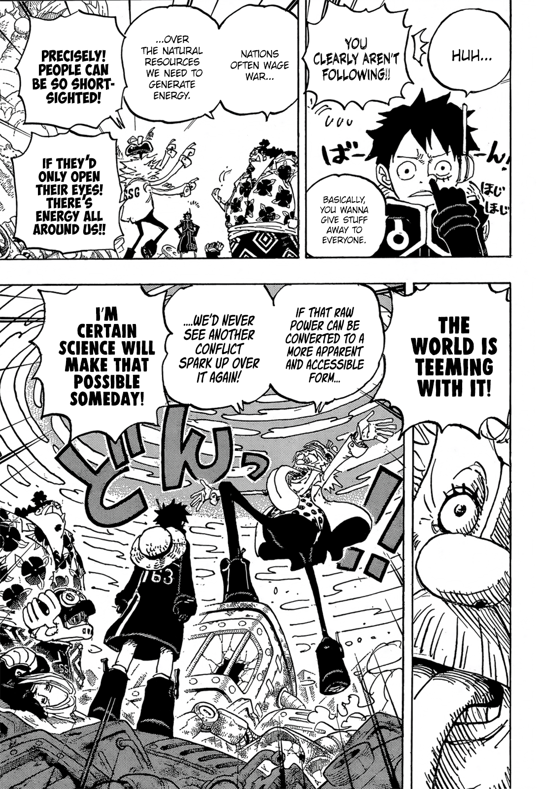

<h1>
  <a href="https://youtu.be/N-bGWFZVc4U">
    The Greatest Players Produce their Greatest Performances when they are needed
  </a> 
</h1>

> "Quiero terminar mi carrera y ganar algo con la selección de Argentina, y si no haberlo intentado todas las veces posibles, no quedarme con la sensación de que no se me dio y dejé pasar oportunidades por la gente que no quería que esté, o los comentarios malos hacía mi, eeeh...
>> **Levantarme, volverlo a intetarlo y volver a estar otra vez**, creo que ese es el mensaje para los niños y los chicos que me siguen que les gusta verme. No sólo para el fútbol, sino para la vida. **Porque eso es la vida, tropezar, volver a levantarse e intentarlo otra vez, y luchar por sus sueños.**"
~ Messi.

  

<h1>I'm a Problem Solver</h1>

<h2>🌟 Programming Languages</h2>

  
  
  
  

<h2>⚡ Main Technologies<h2>

  
  
  
  
  
  
  
  
  
  
  
  
  
  
  
  
  
  
  
  
  
  
  

<h2>⚡ Operating Systems and distros I use</h2>

> Yup, *I use Arch btw* :P

  
  </a>
  
  
  <a href="https://github.com/Youngermaster/Ubuntu-dotfiles">
  
  
  

<h2>📊 Pentesting stats</h2>

  
  

    
     

<h2>📊 Coding stats</h2>

 
  
  

  
📈 <strong> More stats </strong> 📈

  

    
    
    
    
    
  

<h2>✉️️ Connect with me</h2>

  
  
  
  
  
   

  
🎁 <strong> [CLICK for a Bonus about what I believe] </strong> 🎁

  

  <strong>
  “There is a driving force stronger than steam, electricity and atomic energy: THE WILLPOWER.” - Albert Einstein
  <strong>
    
  

