

  
<h1 align="center">Juan Manuel Young Hoyos</h1>
<h2 align="center">A Problem Solver</h2>

Software Developer

  

<h2 align="center">Technical skills</h2>

<h3 align="center">Main Languages</h3>

⚡ Knowed

  <a
    href="https://github.com/Youngermaster?tab=repositories&q=&type=&language=c%2B%2B">
    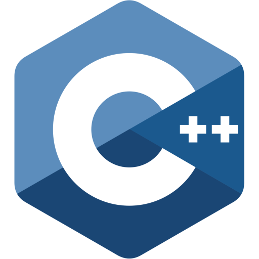
  </a>
  <a
    href="https://github.com/Youngermaster?tab=repositories&q=&type=&language=javascript">
    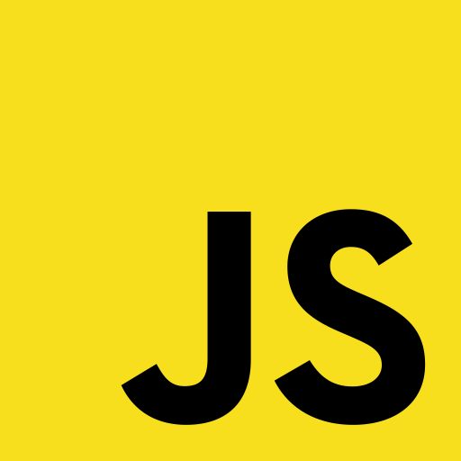
  </a>
  <a
    href="https://github.com/Youngermaster?tab=repositories&q=&type=&language=python">
    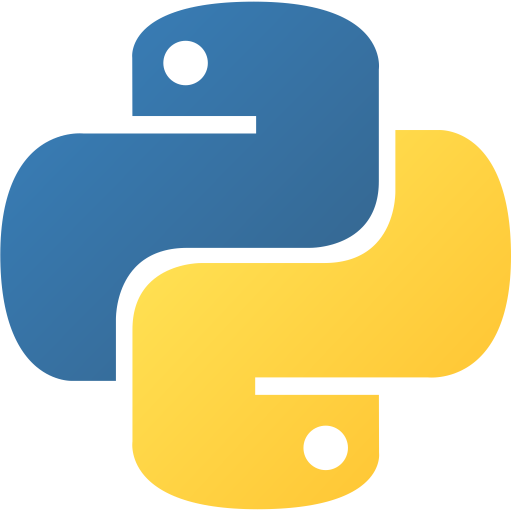
  </a>
  
  

🧠 Learning

  
  <a
    href="https://github.com/Youngermaster/Learning-Programming-Languages/tree/master/Go">
    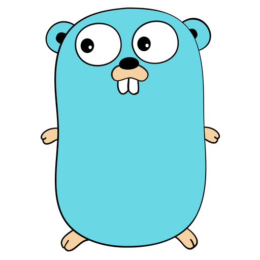
  </a>
  <a
    href="https://github.com/Youngermaster?tab=repositories&q=&type=&language=c%23">
    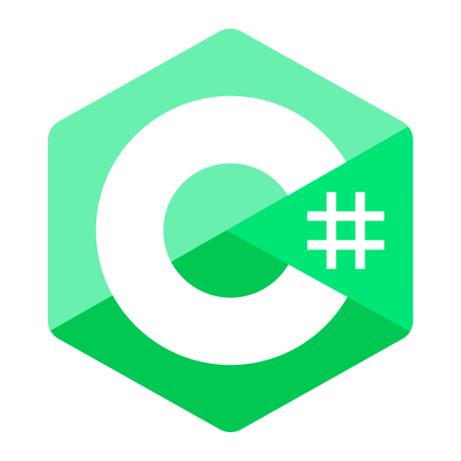
  </a>
  <a
    href="https://github.com/Youngermaster?tab=repositories&q=&type=&language=rust">
    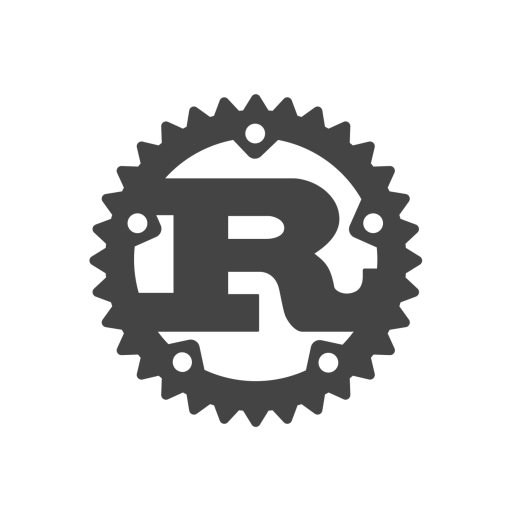
  </a>

<h3 align="center">⚡ Main Technologies</h3>

  <a
    href="https://github.com/Youngermaster?tab=repositories&q=&type=&language=javascript">
    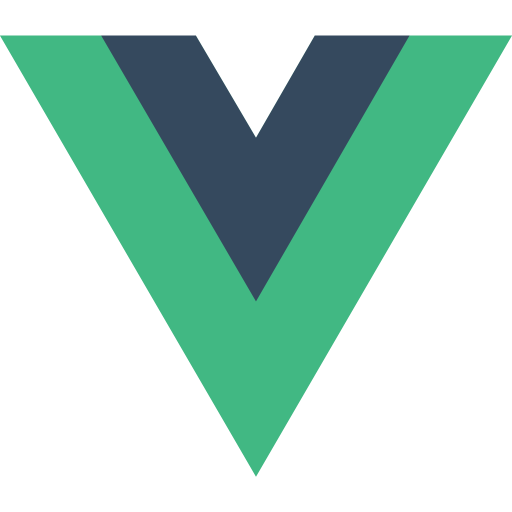
  </a>
  
  
  
  <a
    href="https://github.com/Youngermaster/Docker-Essentials-Coursera-Course">
    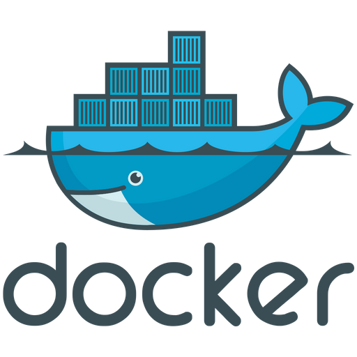
  </a>
  <a
    href="https://github.com/Youngermaster?tab=repositories">
    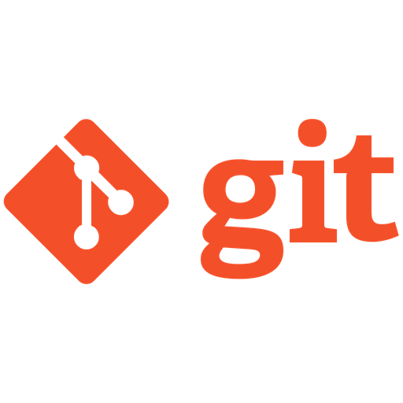
  </a>
  
  

🧠 Learning

  
  
  
  <a
    href="https://raw.githubusercontent.com/github/explore/80688e429a7d4ef2fca1e82350fe8e3517d3494d/topics/postgresql/postgresql.png">
    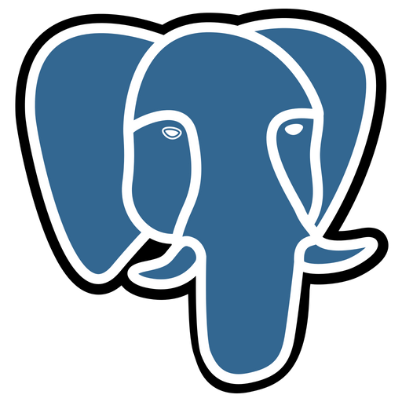
  </a>
  
  
  

<h3 align="center">⚡ Main OS</h3>

  <a
    href="https://raw.githubusercontent.com/github/explore/80688e429a7d4ef2fca1e82350fe8e3517d3494d/topics/ubuntu/ubuntu.png">
    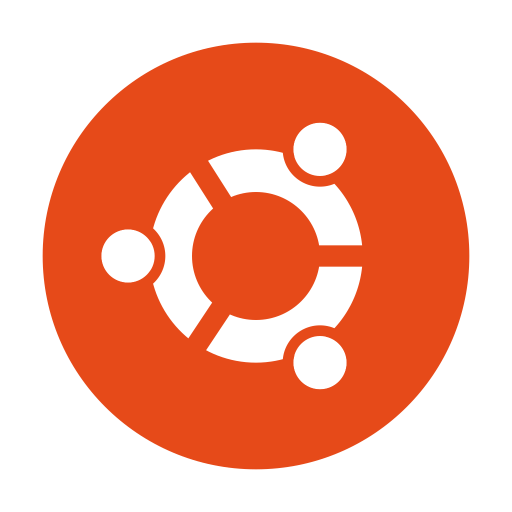
  </a>

🧠 Learning

  <a
    href="/">
    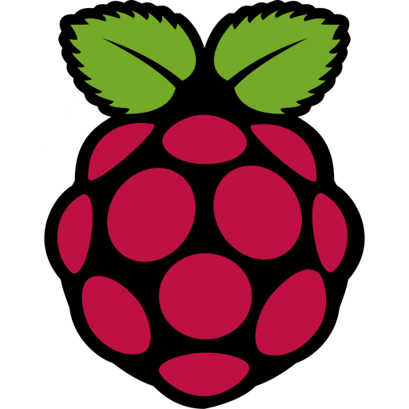
  </a>

<h2 align="center">✉️️ Connect with me</h2>
 

  
  
  
  
  
  
  

<h2 align="center">📊 Stats</h2>
 

  
   
  
  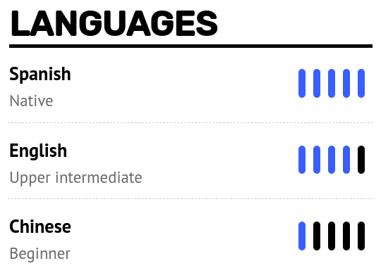

 
<h2 align="center">A little about me:</h2>

  <li align="center">⚡ I’m currently working on <strong>TesMusk</strong>, <strong>Variamos</strong> and <strong>Della</strong>'s smart glasses.</li>
  <li align="center">📙 I’m currently learning <strong>Django</strong>, <strong>CI/CD</strong> and <strong>Vue.js</strong>.</li>
  <li align="center">🔍 I’m looking to collaborate on amazing projetcs to <strong>solve real problems</strong>.</li>
  <li align="center">👱🏼‍♂️ Pronouns: <strong>he/him/his</strong>, although, just tell me <strong>Juan</strong>.</li>
  <li align="center">😄 Fun fact: <strong>I don't like to sleep</strong>.</li>

<h2 align="center">👋🏻 See ya'</h2>

  

