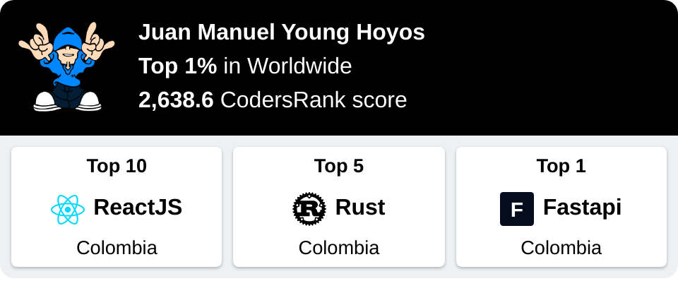
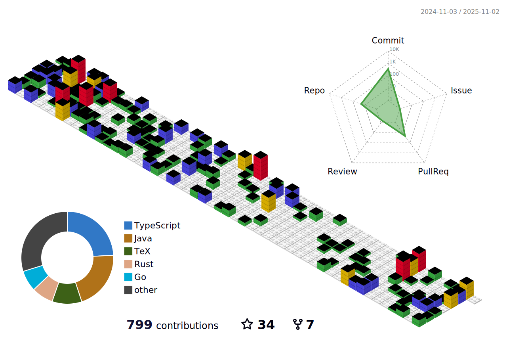

<h1>
  <a href="https://youtu.be/N-bGWFZVc4U">
    The Greatest Players Produce their Greatest Performances when they are needed
  </a> 
</h1>

> "Quiero terminar mi carrera y ganar algo con la selección de Argentina, y si no haberlo intentado todas las veces posibles, no quedarme con la sensación de que no se me dio y dejé pasar oportunidades por la gente que no quería que esté, o los comentarios malos hacía mi, eeeh...
>> **Levantarme, volverlo a intetarlo y volver a estar otra vez**, creo que ese es el mensaje para los niños y los chicos que me siguen que les gusta verme. No sólo para el fútbol, sino para la vida. **Porque eso es la vida, tropezar, volver a levantarse e intentarlo otra vez, y luchar por sus sueños.**"
~ Messi.


<p align="center">
  
</p>
<hr />

<h1>I'm a Problem Solver</h1>


<h2>🌟 Programming Languages</h2>
<p>
  
  
  
  
</p>

<h2>⚡ Main Technologies<h2>
<p>
  
  
  
  
  
  
  
  
  
  
  
  
</p>

<h2>⚡ Main OS</h2>

<p>
  
  
  
  
</p>

<h2>📊 Pentesting stats</h2>
<div>
  <a href="https://app.hackthebox.com/profile/1146422">
            
  </a>
  <a href="https://app.hackthebox.com/profile/643960">
        
  </a>
</div>

<div>
    <a href="https://tryhackme.com/p/Lyyyyynx">
      
    </a>
     <a href="https://tryhackme.com/p/Youngermaster">
      
    </a>
</div>


<h2>📊 Coding stats</h2>

<p> 
  <a href="https://profile.codersrank.io/user/youngermaster">
      
  </a>
  <a href="https://profile.codersrank.io/user/youngermaster">
      
  </a>



<details>

  <summary>📈 <strong> More stats </strong> 📈</summary>

  <p>
    <a href="https://github.com/youngermaster">
      
    </a>
    <a href="https://github.com/youngermaster">
      
    </a>
    <a href="https://github.com/youngermaster">
      
    </a>
    <a href="https://github.com/youngermaster">
      
    </a>
    <a href="https://github.com/youngermaster">
      
    </a>
  </p>
</details>
</p>


<h2>✉️️ Connect with me</h2>
<p>
  <a href="https://www.linkedin.com/in/juan-manuel-young-hoyos/">
    
  </a>
  <a href="https://www.instagram.com/jmyounghoyos/">
    
  </a>
  <a href="https://twitter.com/jmyounghoyos">
    
  </a>
  <a href="https://discord.bio/p/youngermaster">
    
  </a>
  <a href="https://www.youtube.com/channel/UCyuYHymUH4Adj2YytTdtD4g/videos">
    
  </a>
  <a href="https://gist.github.com/Youngermaster/d062cf824d5007105aa2ea32d6e988e2">
    
  </a> <a href="mailto:juanmanuel12.13jmyh81@gmail.com">
    
  </a>
</p>

<details>

  <summary>🎁 <strong> [Bonus about what I belive] </strong> 🎁</summary>

  <p>
    <a href="https://youtu.be/XzjtV8ZFvQw?t=1246">
      
    </a>
  </p>

</details>

```
My Blog:
https://blog.jmyounghoyos.com/
```
